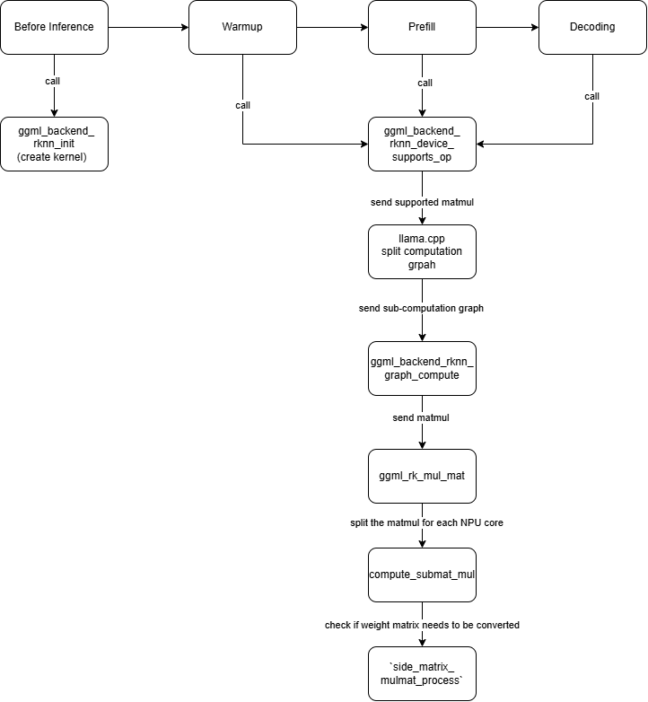

## 1. Overview

This document describes the integration of the `RKNPU` backend into the `llama.cpp` inference framework. The integration enables inference acceleration using NPU with RKNN-Toolkit.

Core Process:



## 2. Architecture Overview

- `llama.cpp` uses the `ggml` tensor library to perform low-level operations.
- Backends in `ggml` are modular and support operator-specific offloading.

### Components Added or Modified:

| File                                | Description                                                  |
| ----------------------------------- | ------------------------------------------------------------ |
| `ggml/src/ggml-rknn/ggml-rknn.cpp`  | The implementation of `rknpu` backend                        |
| `ggml/src/ggml-rknn/CMakeLists.cpp` | Compile file                                                 |
| `ggml/src/ggml-backend-reg.cpp`     | Register the `rknpu` backend in GGML                         |
| `ggml/src/CMakeLists.txt`           | Compile file                                                 |
| `ggml/include/ggml-rknn.h`          | The header file of `rknpu` backend                           |
| `ggml/include/fp16`                 | Introduce the `rknn` `fp16` variable type                    |
| `ggml/include/rknn_api.h`           | Introduce the `rknn` API                                     |
| `ggml/include/rknn_custom_op.h`     | Introduce the `rknn` API                                     |
| `ggml/include/rknn_matmul_api.h`    | Introduce the `rknn` API                                     |
| `scripts/mat_kernel_size.json`      | Tell the backend the shape of matrix multiplication could be offloaded. |
| `lib/librknnrt.so`                  | Library file from RKNN-toolkit                               |
| `CMakeLists.txt`                    | Compile file                                                 |
| `model_related_config.h`            | Tells backend necessary path information.                    |

## 3. Implementation Details

### 3.1 Compilation Files - CMakeLists.txt

For compiling the program, llama.cpp uses CMakeLists to organise files. In order to integrate the API of  `RKNN-Toolkit` to the llama.cpp, we need to modify `CMakeLists.txt` in each folder layer.

###  `ggml/CMakeLists.txt`

@line 197:

```cmake
option(GGML_RKNN 	"ggml: use RKNN"	OFF)
```

This option tells `cmake` to use `ggml_rknn` generate compile files.

@line 268:

```cmake
set(GGML_PUBLIC_HEADERS
    include/ggml.h
    include/ggml-cpu.h
    include/ggml-alloc.h
    include/ggml-backend.h
    include/ggml-blas.h
    include/ggml-cann.h
    include/ggml-cpp.h
    include/ggml-rknn.h
    include/ggml-cuda.h
    include/ggml-kompute.h
    include/ggml-opt.h
    include/ggml-metal.h
    include/ggml-rpc.h
    include/ggml-sycl.h
    include/ggml-vulkan.h
    include/gguf.h)
```

Need to tell compiler where the header file is.

### `ggml/src/CMakeLists.txt`

@line 310:

```cmake
ggml_add_backend(rknn)
```

Tell optimizer `rknn` backend should be registered.

### `ggml/src/ggml-rknn/CMakeLists.txt`

This file does following things:

1. add one configure file(for reading specific matrix kernel dimension in the program).
2. add one custom library json from github.
3. set the backend name to `ggml-rknn` then find the right header and source file.

```cmake
configure_file(
    ../../include/model_related_config.h.in
    ${CMAKE_BINARY_DIR}/model_related_config.h
    @ONLY
)
include_directories(${CMAKE_BINARY_DIR})

include(FetchContent)
FetchContent_Declare(
    json
    GIT_REPOSITORY https://github.com/nlohmann/json.git
    GIT_TAG v3.11.2
)
FetchContent_MakeAvailable(json)

set(TARGET_NAME ggml-rknn)

ggml_add_backend_library(${TARGET_NAME}
                            ggml-rknn.cpp
                            ../../include/ggml-rknn.h)

if(DEFINED GGML_DEBUGING)
    add_compile_definitions(GGML_RKNN_DEBUGING)
endif()

target_link_directories(${TARGET_NAME} PRIVATE ${CMAKE_SOURCE_DIR}/include)
${CMAKE_SOURCE_DIR}/lib/librknnrt.so nlohmann_json::nlohmann_json)
target_include_directories(${TARGET_NAME} PRIVATE ${CMAKE_SOURCE_DIR}/lib)
```


### 3.2 Backend Registration

### `ggml/src/ggml-backend-reg.cpp`

To register `ggml-rknn` backend, we need to add several lines inside this file:

@line 53:

```c
#ifdef GGML_USE_RKNN
#include "ggml-rknn.h"
#endif 
```

@line 187

```c
 struct ggml_backend_registry {

#ifdef GGML_USE_RKNN
        register_backend(ggml_backend_rknn_reg());
#endif
```

@line 567 - find the ggml-rknn lib.

```c
ggml_backend_load_best("rknn", silent, dir_path);
```

### 3.4 Must-implement data structures

This section will introduce in order to add `ggml-rknn` backend to llama.cpp, what data structures we need to implement.  The codes in this section can be found in `ggml/ggml-rknn/ggml-rknn.cpp`.

#### `ggml_backend_rknn_reg_i`

This struct shows the basic attribution of the backend.  It will be used when the 

 The variables in this struct are function pointers.

```c
static struct ggml_backend_reg_i ggml_backend_rknn_reg_i = {
    /* .get_name         = */ ggml_backend_rknn_reg_get_name,
    /* .device_count     = */ ggml_backend_rknn_reg_device_count,
    /* .device_get       = */ ggml_backend_rknn_reg_device_get,
    /* .get_proc_address = */ ggml_backend_rknn_get_proc_address,
};
```

From top to bottom, the functions are:

##### `ggml_backend_rknn_reg_get_name`

```c
static const char * ggml_backend_rknn_reg_get_name(ggml_backend_reg_t reg) {
    return "RKNN";
    GGML_UNUSED(reg);
}
```

##### `ggml_backend_rknn_reg_device_count`

`ggml_backend_rknn_n_devices` is a global constants. It always be 1 since on rk3588 we only have one 3-core NPU.

```c
static size_t ggml_backend_rknn_reg_device_count(ggml_backend_reg_t reg) {
    return ggml_backend_rknn_n_devices; 
    GGML_UNUSED(reg);
}
```

##### `ggml_backend_rknn_reg_device_get`

In this function, we need another detailed backend descriptor, which is implement by another sturct `ggml_backend_rknn_device_i`. This descriptor is written in the next section.

```c
static ggml_backend_dev_t ggml_backend_rknn_reg_device_get(ggml_backend_reg_t reg, size_t index) {
    GGML_ASSERT(index == 0);
    static ggml_backend_device ggml_backend_rknn_device = {
        /* .iface   = */ ggml_backend_rknn_device_i,
        /* .reg     = */ reg,
        /* .context = */ nullptr,
    };
    // return &g_ggml_backend_rknn_device;
    return &ggml_backend_rknn_device;

    GGML_UNUSED(reg);
    GGML_UNUSED(index);
}

```

#### `ggml_backend_rknn_device_i`

```c
static const struct ggml_backend_device_i ggml_backend_rknn_device_i = {
    /* .get_name             = */ ggml_backend_rknn_device_get_name,
    /* .get_description      = */ ggml_backend_rknn_device_get_description,
    /* .get_memory           = */ ggml_backend_rknn_device_get_memory,
    /* .get_type             = */ ggml_backend_rknn_device_get_type,
    /* .get_props            = */ ggml_backend_rknn_device_get_props,
    /* .init_backend         = */ ggml_backend_rknn_device_init_backend,
    /* .get_buffer_type      = */ ggml_backend_rknn_device_get_buffer_type,
    /* .get_host_buffer_type = */ NULL,
    /* .buffer_from_host_ptr = */ ggml_backend_rknn_device_buffer_from_host_ptr,
    /* .supports_op          = */ ggml_backend_rknn_device_supports_op,
    /* .supports_buft        = */ ggml_backend_rknn_device_supports_buft,
    /* .offload_op           = */ NULL,
    /* .event_new            = */ NULL,
    /* .event_free           = */ NULL,
    /* .event_synchronize    = */ NULL,
};
```

##### `ggml_backend_rknn_device_get_name`

```c
static const char * ggml_backend_rknn_device_get_name(ggml_backend_dev_t dev) {
    return "RKNN";
    GGML_UNUSED(dev);
}
```

##### `ggml_backend_rknn_device_get_description`

This function returns the name of the device.

```c
static const char * ggml_backend_rknn_device_get_description(ggml_backend_dev_t dev) {
    #if defined(GGML_BLAS_USE_ACCELERATE)
        return "Accelerate";
    #elif defined(GGML_BLAS_USE_MKL)
        return "MKL";
    #elif defined(GGML_BLAS_USE_BLIS)
        return "BLIS";
    #elif defined(GGML_BLAS_USE_NVPL)
        return "NVPL";
    #elif defined(OPENBLAS_VERSION)
        return "OpenBLAS";
    #else
        return "RKNN";
    #endif

    GGML_UNUSED(dev);
}
```

##### `ggml_backend_rknn_device_get_memory`

This API needs to return the memory the device have. Since NPU uses the DRAM, we just simply return s current system's DRAM remains. The DRAM could be seen as unified memory in such context.

```c
static void ggml_backend_rknn_device_get_memory(ggml_backend_dev_t dev, size_t * free, size_t * total) {
    struct sysinfo info;
    if (sysinfo(&info) == 0) {
        *free = info.freeram;
        *total = info.totalram;
        *free = *free * info.mem_unit;
        *total = *total * info.mem_unit;
    } else {
        std::cout<< "sysinfo failed" << "\n";
    }

    GGML_UNUSED(dev);
}
```

##### `ggml_backend_rknn_device_get_type`

This function needs to return the type of device. In llama.cpp, there are three different kinds of `dev_type`:

```c
// @ ggml-backend.h  
enum ggml_backend_dev_type {
      // CPU device using system memory
      GGML_BACKEND_DEVICE_TYPE_CPU,
      // GPU device using dedicated memory
      GGML_BACKEND_DEVICE_TYPE_GPU,
      // accelerator devices intended to be used together with the CPU backend (e.g. BLAS or AMX)
      GGML_BACKEND_DEVICE_TYPE_ACCEL
  };
```

Since the `RKNPU` needs its own memory inside the DRAM, I chose to return `TYPE_GPU` in this function.

```c
static enum ggml_backend_dev_type ggml_backend_rknn_device_get_type(ggml_backend_dev_t dev) {
    return GGML_BACKEND_DEVICE_TYPE_GPU;

    GGML_UNUSED(dev);
}
```

##### `ggml_backend_rknn_device_get_props`

This function need to return the properties of the backend. `props->name`, `props->description`, `props->type` has been introduced before. 

The only problem is how should we decide the attributions inside `caps`.

In `src/llama-context.cpp:276`

```c
ggml_backend_dev_get_props(dev, &props);
if (!props.caps.async || !props.caps.events) {
    // device does not support async compute or events
    pipeline_parallel = false;
    break;
}
```

So the `props.caps` determines if the backend supports `pipeline_parallel`. For better debugging, I set the `async` and `events` to false.

 `host_buffer` and `buffer_from_host_ptr` are set to true because the NPU is using DRAM.

```c
static void ggml_backend_rknn_device_get_props(ggml_backend_dev_t dev, struct ggml_backend_dev_props * props) {
    props->name        = ggml_backend_rknn_device_get_name(dev);
    props->description = ggml_backend_rknn_device_get_description(dev);
    props->type        = ggml_backend_rknn_device_get_type(dev);
    ggml_backend_rknn_device_get_memory(dev, &props->memory_free, &props->memory_total);
    props->caps = { 
        /* .async                 = */ false,
        /* .host_buffer           = */ true,
        /* .buffer_from_host_ptr  = */ true,
        /* .events                = */ false,
    };
}
```

##### `ggml_backend_rknn_device_init_backend`

This function describes how backend init the backend. The `ggml_backend_rknn_init()` function is introduced in section 3.3.

```c
static ggml_backend_t ggml_backend_rknn_device_init_backend(ggml_backend_dev_t dev, const char * params) {
    return ggml_backend_rknn_init();
    GGML_UNUSED(dev);
    GGML_UNUSED(params);
}
```

##### `ggml_backend_rknn_device_supports_op`

Input:

1. `ggml_backend_dev_t dev`: RKNN backend. `GGML` asked to reserve this parameter.
2. `const struct ggml_tensor *op`: `GGML` Tensor tells which operation it needs to be run and where the source data is.

Output:

1. bool variable to tell if the OP could be run on the rknn backend.

Workflow:

1. Verify whether the matrix multiplication dimensions (`m`, `k`, `n`) recorded in the current op match those read from the weight file. The following fields must be validated:

   1. `m`: Number of rows in matrix A
   2. `k`: Number of columns in matrix A (also the number of rows in matrix B)
   3. `n`: Number of columns in matrix B
   4. `name`: The op’s node name and layer identifier

   If **all** fields match, the function returns `true`; otherwise, it returns `false`.

```c

static bool ggml_backend_rknn_device_supports_op(ggml_backend_dev_t dev, const struct ggml_tensor * op) {

    // printf("%s ", ggml_op_name(op->op));
    switch (op->op) {
        case GGML_OP_MUL_MAT:
        {
            // printf("op->name: %s\n", op->name);
            const struct ggml_tensor * src0 = op->src[0];
            const struct ggml_tensor * src1 = op->src[1];
            const struct ggml_tensor * dst = op;
            const int64_t ne00 = src0->ne[0]; // k
            const int64_t ne01 = src0->ne[1]; // m
            const int64_t ne10 = src1->ne[0]; // k
            const int64_t ne11 = src1->ne[1]; // n
            const int64_t ne0 = dst->ne[0]; // m
            const int64_t ne1 = dst->ne[1]; // n
            bool result = true;

            if(dst->type != GGML_TYPE_F32){
                result = false;
            }
            result = false;

            for(matrixPair &matrix_pair : support_matrices){
                matrix_ctx A = {matrix_pair.src0.row, matrix_pair.src0.col, NULL, matrix_pair.name.c_str()};
                matrix_ctx B = {matrix_pair.src1.row, matrix_pair.src1.col, NULL, matrix_pair.name.c_str()};
                if(A.row == ne11 && A.col == ne10 && B.row == ne00 && B.col == ne01
                    && std::strcmp(op->name, matrix_pair.name.c_str()) == 0
                ){
                    result = true;
                    break;
                }
            }
            return result;
        }
        default:
            return false;

    }

    GGML_UNUSED(dev);
}
```

#### `ggml_backend_rknn_i`

```c
static ggml_backend_i ggml_backend_rknn_i = {
    /* .get_name                = */ ggml_backend_rknn_name,
    /* .free                    = */ ggml_backend_rknn_free,
    /* .set_tensor_async        = */ NULL,  /* ggml_backend_opencl_set_tensor_async */
    /* .get_tensor_async        = */ NULL,  /* ggml_backend_opencl_get_tensor_async */
    /* .cpy_tensor_async        = */ NULL,  /* ggml_backend_opencl_cpy_tensor_async */
    /* .synchronize             = */ NULL,  /* ggml_backend_opencl_synchronize */
    /* .graph_plan_create       = */ NULL,
    /* .graph_plan_free         = */ NULL,
    /* .graph_plan_update       = */ NULL,
    /* .graph_plan_compute      = */ NULL,
    /* .graph_compute           = */ ggml_backend_rknn_graph_compute,
    /* .event_record            = */ NULL,
    /* .event_wait              = */ NULL,
};
```

## 3.3 Must-implement APIs

The content in this section are mainly about the functions in the `ggml-rknn.h` header file.

###  `GGML_BACKEND_API ggml_backend_t ggml_backend_rknn_init ()`

`ggml_backend_rknn_reg()` will be introduced later.

This function reads the kernel shape definitions from the file `scripts/mat_kernel_size.json` and stores them in the `matmul_kernels` array.

```c
ggml_backend_t ggml_backend_rknn_init(void) {
    printf("@ggml-rknn.cpp\n");
    printf("start rknn init!\n");
    ggml_backend_dev_t dev = ggml_backend_reg_dev_get(ggml_backend_rknn_reg(), 0);
    printf("register the rknn!\n");
    ggml_backend_rknn_context * context = (ggml_backend_rknn_context *) malloc(sizeof(ggml_backend_rknn_context));
    printf("creating the backend!\n");
    int n_threads = 3;
    if(!has_init_kernel_from_file){

        std::vector<matrixPair> matrix_pairs;
        bool status = read_shape_pairs_from_json(std::string(CONFIG_DIR) + "/mat_kernel_size.json", matrix_pairs);
        // bool status = true;
        if(!status){
            printf("read shape pairs from json failed!\n");
            exit(-1);
        }

        for(matrixPair &matrix_pair : matrix_pairs){
            printf("matrix_pair: (%d, %d), (%d, %d)\n", matrix_pair.src0.row, matrix_pair.src0.col, matrix_pair.src1.row, matrix_pair.src1.col);
            matrix_ctx A = {matrix_pair.src0.row, matrix_pair.src0.col, NULL, "A"};
            matrix_ctx B = {matrix_pair.src1.row, matrix_pair.src1.col, NULL, "B"};
            size_t matrix_A_size = A.row * A.col * sizeof(float16);
            size_t matrix_B_size = B.row * B.col * sizeof(float16);
            int initialized = 0;

            int mod_number = 32 * n_threads;
            printf("matrix_pair.name.c_str(): %s\n", matrix_pair.name.c_str());
            for(int i = 0 ; i < n_threads;i++){
                    int split_B_col= B.col / 32 / 3 * 32;
                    if(i == n_threads - 1)
                        split_B_col = B.col - (n_threads - 1) * split_B_col;
                    char * op_name = (char*)malloc(sizeof(char) * matrix_pair.name.length());
                    for(int j = 0 ; j <matrix_pair.name.length();j++){
                        op_name[j] = matrix_pair.name[j];
                    }
                    ggml_rknpu2_matmul_kernel * kernel = ggml_rknpu2_matmul_kernel_create(
                    A.data,
                    B.data,
                    matrix_A_size,
                    matrix_B_size,
                    A.row,
                    A.col,
                    split_B_col,
                    RKNN_FLOAT16_MM_FLOAT16_TO_FLOAT32,
                    i,
                    initialized,
                    true,
                    op_name
                );
            }
        }
        has_init_kernel_from_file = true;
        for(int i = 0 ; i < matmul_kernels_count; i++){
            printf("kernel %d:\n", i);
            printf("dims: %d, %d, %d, kernel->name: %s\n", matmul_kernels[i].info.M, matmul_kernels[i].info.K, matmul_kernels[i].info.N, matmul_kernels[i].name);
        }
    }

    ggml_backend_t backend = new ggml_backend {
        /* .guid      = */  ggml_backend_rknn_guid(),
        /* .interface = */  ggml_backend_rknn_i,
        /* .device    = */  dev,
        /* .context   = */  context
    };
    printf("done!\n");

    bool status = read_shape_pairs_from_json(std::string(CONFIG_DIR) + "/mat_kernel_size.json", support_matrices);
    // bool status = true;
    if(!status){
        printf("read shape pairs from json failed!\n");
        return NULL;
    }
    return backend;
}
```

#### `ggml_backend_rknn_guid()`

GUID should be an identifier. This guid is generated by a linux tool.

```c
static ggml_guid_t ggml_backend_rknn_guid() {
    //c9bdb702-4936-4212-af35-a287d8c02920
    static ggml_guid guid = { 0xc9, 0xbd, 0xb7, 0x02, 0x49, 0x36, 0x42, 0x12, 0xaf, 0x35, 0xa2, 0x87, 0xd8, 0xc9, 0x29, 0x20 };
    return &guid;
}
```


### `GGML_BACKEND_API bool ggml_backend_is_rknn(ggml_backend_t backend)`

Use `guid` to check if backend is `ggml-rknn`.

```c
bool ggml_backend_is_rknn(ggml_backend_t backend){
    return backend != NULL && ggml_guid_matches(backend -> guid, ggml_backend_rknn_guid());
}
```

### `GGML_BACKEND_API void ggml_backend_rknn_set_n_threads(ggml_backend_t backend_rknn, int n_threads);`

After checking the backend is `ggml_rknn`, we could set how many NPU cores we will use for matrix multiplication.

```c
void ggml_backend_rknn_set_n_threads(ggml_backend_t backend_rknn, int n_threads){
    GGML_ASSERT(ggml_backend_is_rknn(backend_rknn));
    ggml_backend_rknn_context * ctx = (ggml_backend_rknn_context *) backend_rknn -> context;
    ctx->n_threads = n_threads;
}
```

### `GGML_BACKEND_API ggml_backend_reg_t ggml_backend_rknn_reg(void);`

This function mainly is used to check if the backend has been initialized. If it has not initialized, return the backend's register information.

```c
ggml_backend_reg_t ggml_backend_rknn_reg(void) {
    static ggml_backend_reg reg;
    static bool initialized = false;
    if (!initialized) {
         reg = ggml_backend_reg {
            /* .api_version = */ GGML_BACKEND_API_VERSION,
            /* .iface   = */ ggml_backend_rknn_reg_i,
            /* .context = */ NULL,
         };
        initialized = true;
    }
    return &reg;
}
```

###  `static void * ggml_backend_rknn_get_proc_address(ggml_backend_reg_t reg, const char * name)`

`get_proc_address` usually used in **getting the function or variable address in DLL during the runtime dynamically**. Reference to [ggml_blas](https://github.com/ggml-org/llama.cpp/blob/master/ggml/src/ggml-blas/ggml-blas.cpp), I just return the `ggml_backend_set_n_threads` function. Otherwise it returns with `NULL`.

```c
static void * ggml_backend_rknn_get_proc_address(ggml_backend_reg_t reg, const char * name) {
    if (std::strcmp(name, "ggml_backend_set_n_threads") == 0) {
        return (void *)ggml_backend_rknn_set_n_threads;
    }
    return NULL;

    GGML_UNUSED(reg);
    GGML_UNUSED(name);
    return NULL;
}
```

## 4. Matmul implementation & Optimization

To compute the matmul on `rknpu`, we need to implement the following workflow:

1. Implement `ggml_backend_rknn_graph_compute` function to process the computation graph. In this function, the `matmul` operation should be forwarded to `ggml_rk_compute_forward` to check the operation is valid or not.
2. If the operation is valid, the `ggml_tensor` will be sent to `ggml_rk_mul_mat` to implement matrix multiplication.
3. In `ggml_rk_mul_mat`, the matrix multiplication should be processed and the result will be written to one `ggml_tensor` variable.

### `ggml_backend_rknn_graph_compute`

In this function, the nodes in the computation graph are iterated. The nodes are forwarded to `ggml_rk_copmute_forward` function.

```c
static ggml_status ggml_backend_rknn_graph_compute(ggml_backend_t backend, ggml_cgraph * cgraph) {
    // printf("rknn graph compute!!!!!!!!\n");
    
    for (int i = 0; i < cgraph->n_nodes; i++) {
        ggml_tensor * node = cgraph->nodes[i];

        struct timespec start_compute_forward;
        clock_gettime(CLOCK_MONOTONIC, &start_compute_forward);
        bool ok = ggml_rk_compute_forward(backend, node);
        if (!ok) {
            GGML_LOG_ERROR("%s: error: op not supported %s (%s)\n", __func__, node->name, ggml_op_name(node->op));
        }
        struct timespec end_compute_forward;
        clock_gettime(CLOCK_MONOTONIC, &end_compute_forward);

        printf("Node %d: %s (%s) compute time: %llu ns, start_time: %llu, end_time: %llu\n", i, node->name, ggml_op_name(node->op), timespec_ns(timespec_sub(&end_compute_forward, &start_compute_forward, &end_compute_forward)), timespec_ns(&start_compute_forward), timespec_ns(&end_compute_forward));

        GGML_ASSERT(ok);


    }

    return GGML_STATUS_SUCCESS;
}
```

### `ggml_rk_compute_forward`

This function will check the tensor's op is `MUL_MAT` or not. If not, return false to the `graph_compute` function.

If it is `MUL_MAT`, function need to check the `MAT_MUL` type is supported in `RKNN-Toolkit` or not.

```c
bool ggml_rk_compute_forward(ggml_backend_t backend, struct ggml_tensor * tensor) {
    ggml_rk_func_t func = nullptr;

    ggml_tensor * src0 = tensor->src[0];
    ggml_tensor * src1 = tensor->src[1];

    if(tensor->op == GGML_OP_MUL_MAT){
        func = ggml_rk_mul_mat;
    }
    else{
        return false;
    }

    rknn_matmul_type matmul_type;
    matmul_type = RKNN_FLOAT16_MM_FLOAT16_TO_FLOAT32;
    if(src0->type == GGML_TYPE_F16 && src1->type == GGML_TYPE_F16){
        matmul_type = RKNN_FLOAT16_MM_FLOAT16_TO_FLOAT32;
    }else if(src0->type == GGML_TYPE_Q8_0 && src1->type == GGML_TYPE_Q8_0){
        matmul_type = RKNN_INT8_MM_INT8_TO_INT32;
    }
    auto start = std::chrono::high_resolution_clock::now();
    func(backend, tensor->src[0], tensor->src[1], tensor, matmul_type);
    auto end = std::chrono::high_resolution_clock::now();
    auto duration = std::chrono::duration_cast<std::chrono::microseconds>(end - start);

    return true;
}
```

### `ggml_rk_mul_mat`

This function preprocesses the `MUL_MAT` op.  

Workflow in this function is like:

1. First determine how many threads the backend needs.
2. Then convert `Vector B`'s data from `FP32` to `FP16` since `RKNN-Toolkit` only supports `F16 x F16 = F32`
3. Check if `Matrix A` has been converted to `perf_layout`. If not, convert it.
4. Initialize the value of `dst` to 0.
5. Create threads, determine the sub-matrices are assigned to the corresponding thread.
6. Threads start. Call `compute_submat_mul` for matrix multiplication.

```c
static void ggml_rk_mul_mat(ggml_backend_t backend, ggml_tensor * src0, ggml_tensor * src1, ggml_tensor * dst, rknn_matmul_type inference_type) {
    std::vector<std::thread> threads;
    const int64_t n = src1->ne[1]; // matrix B columns
    int n_threads = (int)((ggml_backend_rknn_context * )backend->context)->n_threads;
    threads.reserve(n_threads);

    int64_t k = src1->ne[0];
    int64_t m = src0->ne[1];

    void * A_data = src0->data;
    void * B_data_f32 = src1->data;
    void * B_data = malloc(n * k * sizeof(rknpu2::float16));
    for(int i = 0 ; i < n * k ; i++)
        ((rknpu2::float16 *)B_data)[i] = GGML_FP32_TO_FP16(((float *)B_data_f32)[i]);

    void * A_perf_data;
    if(src0->extra == NULL){
        A_perf_data= malloc(m * k * sizeof(rknpu2::float16));
        transposed_matrix_to_perf_layout_multi_threads(A_data, A_perf_data, k, m, 32, 16);
        src0->extra = A_perf_data;
    }else{
        A_perf_data = src0->extra;
    }

    memset(dst->data, 0, dst->ne[0] * dst->ne[1] * sizeof(float));

    int threads_number = n_threads;

    for(int i = n_threads; i >= 1; i--){
        if(m % (16 * i) != 0){
            threads_number = i;
        }else{
            break;
        }
    }

    for(int t = 0; t < threads_number; t++){
        /*
        For mulmat dimension m can be diveded by 32 but not 96
        We do not split in average
        */
        int64_t col_start = t * m / threads_number / 32 * 32;
        int64_t col_end = (t + 1) * m / threads_number / 32 * 32; // divide into threads_number parts.
        if (col_end > m){
            col_end = m;
        }
        int64_t sub_n = col_end - col_start;

        void * A_compute_data = (rknpu2::float16*)A_perf_data+ col_start * k;
        void * B_compute_data = B_data;

        // run the thread;
        threads.emplace_back([m, A_compute_data, B_compute_data, dst, col_start, col_end, t, inference_type, k, n, src0, src1](){
            compute_submat_mul(src0, src1, dst, B_compute_data, A_compute_data, col_start, col_end, t, inference_type);
        });
    }
    for (auto & th : threads) {
        th.join();
    }
}
```

### `compute_submat_mul`

Parameters：

1. `ggml_tensor *src0`: Source tensor 0
2. `ggml_tensor *src1`: Another input tensor (typically a vector)
3. `ggml_tensor *dst`: Output tensor to store the result
4. `void *A_data`: Raw data pointer for matrix A (should match `src0->data`)
5. `void *B_data`: Raw data pointer for matrix B (should match `src1->data`)
6. `int64_t row_start`: Starting row index for computing partial data in matrix B
7. `int64_t row_end`: Ending row index for computing partial data in matrix B
8. `int thread_idx`: Index of the NPU core to use
9. `rknn_matmul_type type`: Type of matrix multiplication being performed

Process logic:

In this function, the workflow is defined as follows:

1. Define necessary variables

   1. `matmul_ctx` contains the context of matrix multiplication.

      ```c
      struct matmul_ctx{
          mat_info mat_A;
          mat_info mat_B;
          rknn_matmul_type type;
          int thread_idx;
          bool matrix_B00_need_set_io = false;
          int64_t ori_n;
          const char * name;
          matmul_ctx(mat_info mat_A, mat_info mat_B, rknn_matmul_type type, int thread_idx, int64_t ori_n, const char* name_): mat_A(mat_A), mat_B(mat_B), type(type), thread_idx(thread_idx), ori_n(ori_n), name(name_) {}
      };
      ```

   2. `mat_info` describes how a matrix looks like

      ```c
      struct mat_info{
          int64_t row;
          int64_t col;
          int64_t pad_row;
          int64_t pad_col;
          matrix_t matrix_type;
          void ** ori_data;
          void ** pad_data;
          size_t ori_size;
          size_t pad_size;
          char * matrix_name;
          bool is_padded=false;
          bool is_A=false;
      
          mat_info(int64_t row, 
              int64_t col,
              int64_t pad_row, 
              int64_t pad_col, 
              matrix_t matrix_type, 
              void ** ori_data, 
              void ** pad_data, 
              size_t ori_size, 
              size_t pad_size, 
              char * matrix_name, 
              bool is_padded, 
              bool is_A): 
              row(row), 
              col(col), 
              pad_row(pad_row), 
              pad_col(pad_col), 
              matrix_type(matrix_type), 
              ori_data(ori_data), 
              pad_data(pad_data), 
              ori_size(ori_size), 
              pad_size(pad_size), 
              matrix_name(matrix_name), 
              is_padded(is_padded), 
              is_A(is_A)
              {}
      
          mat_info(int64_t row_, 
              int64_t col_,
              matrix_t matrix_type_, 
              void ** data_, 
              bool is_A_, 
              char* name_)
          : mat_info(
                  row_,
                  col_,
                  row_ < 32 ? 32 : (((row_ - 1) / 32 + 1) * 32),
                  col_ < 32 ? 32 : (((col_ - 1) / 32 + 1) * 32),
                  matrix_type_,
                  data_,
                  NULL,
                  row_ * col_ * MATRIX_SIZE[matrix_type_],
                  (row_ < 32 ? 32 : (((row_ - 1)/ 32 + 1) * 32)) * (col_ < 32 ? 32 : (((col_ - 1)/ 32 + 1) * 32)) * MATRIX_SIZE[matrix_type_],
                  name_,
                  false,
                  is_A_
              )
          {
              if(is_A_){
                  this->pad_row = row_;
              }
          }
      
          mat_info(int64_t row_, int64_t col_, matrix_t matrix_type_, void ** data_, bool is_A_)
              : mat_info( row_, col_, matrix_type_, data_, is_A_, NULL) 
          {}
      };
      ```
      

2. Check whether the matrix B converted and stored into the matrix kernel (set `matrix_B00_need_set_io` and `B_is_copied`)
3. Pass the matrix context variable to the `side_matrix_mulmat_process`.
4. Destroy allocated resources.

```c
void compute_submat_mul( // matrix A row
                        ggml_tensor *src0,
                        ggml_tensor *src1,
                        ggml_tensor *dst,
                        void *A_data,
                        void *B_data,
                        int64_t row_start,
                        int64_t row_end,
                        int thread_idx,
                        rknn_matmul_type type)
{
    int64_t m = src1->ne[1];
    int64_t dst_n = src0->ne[1];
    int64_t k = src1->ne[0];
    int64_t ori_k = k;
    int64_t n = row_end - row_start;

    const int64_t A_row_00 = m; // m = 1
    const int64_t A_col_00 = k; // k = 2048

    const int64_t B_row_00 = k; 
    const int64_t B_col_00 = n; // n = 42752

    double prepare_data_time = 0; 
    double total_run_time = 0;
    in_kernel_time kernel_time;
    memset(&kernel_time, 0, sizeof(in_kernel_time));

    void * pad_A00 = nullptr; int fixed_A00 = 0;
    void * pad_B00 = nullptr; int fixed_B00 = 0;
    bool mat_A_mat_B_in_kernel = false;

    void ** ptr_pad_A00 = &pad_A00;
    void ** ptr_pad_B00 = &pad_B00;
    mat_info mat_A = mat_info(A_row_00, A_col_00, FLOAT16, ptr_pad_A00, true);
    mat_info mat_B = mat_info(B_row_00, B_col_00, FLOAT16, ptr_pad_B00, false);

    matmul_ctx A00_B00 = matmul_ctx(mat_A, mat_B, type, thread_idx, dst_n, dst->name);

    ggml_rknpu2_matmul_kernel * tmp_kernel = ggml_rknpu2_matmul_kernel_find(A00_B00);

    if(tmp_kernel != NULL) mat_A_mat_B_in_kernel = true;

    if(A_row_00 != 0 && A_col_00 != 0){
        matrixA_to_perf_layout(A_data, pad_A00, A_row_00, A_col_00);
    }
    bool matrix_B00_need_set_io = true;
    if(B_row_00 != 0 && B_col_00 != 0){
        // goals in this if condition:
        // 1. check if need set io
        // 2. pad_B00 is ready
        pad_B00 = B_data;
        // printf("pad_B00: %p\n", pad_B00);
        // check_pad(B_row_00, B_col_00, pad_B00);
        if(mat_A_mat_B_in_kernel){// make sure tmp_kernel != NULL
            fixed_B00 = 1; //B00's data should not be released after running
            if(tmp_kernel->B_data == pad_B00){
                // pad_B00 is already in kernel, do not need to set io
                matrix_B00_need_set_io = false;
                tmp_kernel->B_is_copied = true;
            }else{
                matrix_B00_need_set_io = true;
                tmp_kernel->B_is_copied = false;
            }
        }
    }
    A00_B00.matrix_B00_need_set_io = matrix_B00_need_set_io;
    bool is_A = true;

    int C_tile = 0;
    side_matrix_mulmat_process(A00_B00, dst, kernel_time, row_start, 0, C_tile);


    if(pad_A00!= nullptr && fixed_A00 == 0)
    {
        free(pad_A00);
    }
    
    if(pad_B00!= nullptr && fixed_B00 == 0)
    {
        free(pad_B00);
    }
}
```

### `side_matrix_mulmat_process`

This function follows the workflow of `RKNN-Toolkit`.

The logic is as follows:

1. Create the matrix multiplication kernel (the kernel creation function is defined later).
2. Copy the weight data (required for matrix multiplication) into the kernel.
3. Use the `set_io_mem` function to transfer the data from the kernel to the NPU or to the DRAM region reserved for the NPU.
4. Run the matrix multiplication.
5. Copy the result to the `dst` vector.

```c
void side_matrix_mulmat_process(matmul_ctx &A00_B00, ggml_tensor *dst, in_kernel_time &kernel_time, int offset_col, int offset_row, int & C_tile){
    void *pad_A00 = *(A00_B00.mat_A.ori_data);
    void *pad_B00 = *(A00_B00.mat_B.ori_data);
    // printf("check pad_A00:\n");
    // check_pad(A00_B00.mat_A.row, A00_B00.mat_A.col, pad_A00);

    int thread_idx = A00_B00.thread_idx;

    mat_info mat_A = A00_B00.mat_A;
    mat_info mat_B = A00_B00.mat_B;

    int64_t A_row_00 = mat_A.row;
    int64_t A_col_00 = mat_A.col;
    int64_t B_row_00 = mat_B.row;
    int64_t B_col_00 = mat_B.col;

    int64_t A_pad_row_00 = mat_A.pad_row;
    int64_t A_pad_col_00 = mat_A.pad_col;
    int64_t B_pad_row_00 = mat_B.pad_row;
    int64_t B_pad_col_00 = mat_B.pad_col;

    int n = A00_B00.ori_n;

    size_t A_size = mat_A.pad_size;
    size_t B_size = mat_B.pad_size;

    rknn_matmul_type type = A00_B00.type;
    bool matrix_B00_need_set_io = A00_B00.matrix_B00_need_set_io;

    int initialized = 0;
    int ret = 0;


    ggml_rknpu2_matmul_kernel *sub_kernel = ggml_rknpu2_matmul_kernel_create(pad_A00, pad_B00, A_size, B_size, A_pad_row_00, A_pad_col_00, B_pad_col_00, type, thread_idx, initialized, false, A00_B00.name);
    sub_kernel->is_using = true;

    if (initialized == 0)
    {
        auto copy_to_mem_start = std::chrono::high_resolution_clock::now();
        memcpy(sub_kernel->A->virt_addr, pad_A00, A_pad_row_00 * A_pad_col_00 * sizeof(rknpu2::float16));
        if(!sub_kernel->B_is_copied){
            memcpy(sub_kernel->B->virt_addr, pad_B00, B_pad_row_00 * B_pad_col_00 * sizeof(rknpu2::float16));
                        sub_kernel->B_is_copied = true;
            sub_kernel->B_data = pad_B00;
        }
        auto copy_to_mem_end = std::chrono::high_resolution_clock::now();
        auto copy_to_mem_duration = std::chrono::duration_cast<std::chrono::microseconds>(copy_to_mem_end - copy_to_mem_start).count();
        kernel_time.memcpy_to_kernel_time += copy_to_mem_duration;
    }

    {
        auto set_io_start = std::chrono::high_resolution_clock::now();
        rknn_matmul_set_io_mem(sub_kernel->ctx, sub_kernel->A, &sub_kernel->io_attr.A);
        if(matrix_B00_need_set_io)
        {
            rknn_matmul_set_io_mem(sub_kernel->ctx, sub_kernel->B, &sub_kernel->io_attr.B);
        }
        rknn_matmul_set_io_mem(sub_kernel->ctx, sub_kernel->C, &sub_kernel->io_attr.C);
        auto set_io_end = std::chrono::high_resolution_clock::now();
        auto set_io_duration = std::chrono::duration_cast<std::chrono::microseconds>(set_io_end - set_io_start).count();
        kernel_time.set_io_time += set_io_duration;

    }

    {
        int64_t run_start = getCurrentTimeUs();
        ret = rknn_matmul_run(sub_kernel->ctx);
        int64_t run_end = getCurrentTimeUs();
        int64_t run_duration = run_end - run_start;
        kernel_time.run_time += run_duration;
    }

    {
        void* norm_layout_C = malloc(A_row_00 * B_col_00 * sizeof(float));
        perf_matrixC_to_norm_layout(sub_kernel->C->virt_addr, norm_layout_C, A_row_00, B_col_00);
        auto sum_result_start = std::chrono::high_resolution_clock::now();
        if (C_tile == 0)
        {
            for (int i = 0; i < A_row_00; i++)
            {
                for (int j = 0; j < B_col_00; j++)
                {
                    float* dst_data = (float *)dst->data + offset_col + offset_row * n;
                    dst_data[i * n + j] += ((float *)norm_layout_C)[i * B_pad_col_00 + j];
                }
            }
        }
        sub_kernel->is_using = false;
        auto sum_result_end = std::chrono::high_resolution_clock::now();
        auto sum_result_duration = std::chrono::duration_cast<std::chrono::microseconds>(sum_result_end - sum_result_start).count();
        kernel_time.sum_result_time += sum_result_duration;
    }
}
```

### `ggml_rknpu2_matmul_kernel_create`

In this function, the logic works as follows:

The function returns a `ggml_rknpu2_matmul_kernel`, which contains all the necessary information for performing matrix multiplication on **a single NPU core**. This includes the matrix dimensions, the NPU core index, the type of matrix multiplication, the corresponding RKNN kernel, and the memory required by that kernel.

The logic is: if a kernel has already been created previously, it will be returned directly. Otherwise, a new kernel will be created. The kernel creation code is based on the RKNN Toolkit.

```cpp
ggml_rknpu2_matmul_kernel* ggml_rknpu2_matmul_kernel_create(const void* A_data, void* B_data, size_t A_size, size_t B_size, int m, int k, int n, rknn_matmul_type type, int core_number, int &initialized, bool is_init = false, const char * name = NULL){
    ggml_rknpu2_matmul_kernel* kernel = NULL;
    if(!is_init){
        kernel = ggml_rknpu2_matmul_kernel_find(m, k, n, type, core_number, A_data, B_data, A_size, B_size, name);
    }

    if(kernel != NULL){
        return kernel;
    }
    else{
        kernel = &matmul_kernels[matmul_kernels_count++];
        if(matmul_kernels_count % GGML_RKNPU2_MAX_MATMUL_KERNELS == 0)
            matmul_kernels_count = 0;
        memset(kernel, 0, sizeof(ggml_rknpu2_matmul_kernel));

        kernel->thread_idx = core_number;
        kernel->info.M = m;
        kernel->info.K = k;
        kernel->info.N = n;
        kernel->info.type = type;
        kernel->info.B_layout = 1; // B use native layout (weight)
        kernel->info.AC_layout = 1; // A and C use original layout (intermediate)
        kernel->name = name;

        int ret = rknn_matmul_create(&(kernel->ctx), &(kernel->info), &(kernel->io_attr));
        GGML_ASSERT(ret == 0);

        if(core_number == 0)
            rknn_matmul_set_core_mask(kernel->ctx, RKNN_NPU_CORE_0);
        else if(core_number == 1)
            rknn_matmul_set_core_mask(kernel->ctx, RKNN_NPU_CORE_1);
        else if(core_number == 2)
            rknn_matmul_set_core_mask(kernel->ctx, RKNN_NPU_CORE_2);

        {
            auto kernel_mem_create_time = std::chrono::high_resolution_clock::now();
            kernel->A = rknn_create_mem(kernel->ctx, kernel->io_attr.A.size);
            kernel->B = rknn_create_mem(kernel->ctx, kernel->io_attr.B.size);
            kernel->C = rknn_create_mem(kernel->ctx, kernel->io_attr.C.size);
            auto kernel_mem_create_time_end = std::chrono::high_resolution_clock::now();   
            auto kernel_mem_create_duration = std::chrono::duration_cast<std::chrono::microseconds>(kernel_mem_create_time_end - kernel_mem_create_time).count();
            printf("kernel_mem_create_duration: %ld us\n", kernel_mem_create_duration);

        }
    }
    {
        kernel->A_size = A_size;
        kernel->B_size = B_size;
    }

    return kernel;
}
```

### `transposed_matrix_to_perf_layout_multi_threads`

This function is responsible for converting a weight matrix from `llama.cpp` into RKNN's **performance layout (perf layout)** format.

Parameters：

- `const void *src`: The memory address of the original matrix to be converted.
- `void *dst`: The destination memory address where the converted matrix will be stored. Memory should be allocated beforehand.
- `int32_t K`: The first dimension of the matrix (i.e., number of columns).
- `int32_t N`: The second dimension of the matrix (i.e., number of rows).
- `int32_t subK`: The number of columns in each sub-matrix, as defined by RKNN's perf layout.
- `int32_t subN`: The number of rows in each sub-matrix, as defined by RKNN's perf layout.

Process Logic：

1. Split the original matrix into smaller sub-matrices based on `subN` and `subK`. Calculate the total number of blocks.
2. Assign a block range to each thread based on its thread ID.
3. Each thread converts its assigned blocks from the original layout to RKNN perf layout.

Return Value：

- NULL(void)

```c
void transposed_matrix_to_perf_layout_multi_threads(
    const void* src, void* dst,
    int32_t K, int32_t N,
    int32_t subK, int32_t subN)
{
    const float16* src_ptr = static_cast<const float16*>(src);
    float16* dst_ptr = static_cast<float16*>(dst);

    const int total_outer = N / subN;  
    const int total_j = K / subK;      

    const int n_threads = 3;
    std::vector<std::thread> threads;
    threads.reserve(n_threads);

    const int min_blocks_per_thread = total_outer / n_threads;
    const int remainder = total_outer % n_threads;

    for (int t = 0; t < n_threads; ++t) {
        const int start_outer = t * min_blocks_per_thread + std::min(t, remainder);
        const int end_outer = start_outer + min_blocks_per_thread + (t < remainder ? 1 : 0);

        threads.emplace_back([=]() {
            process_range(
                src_ptr, dst_ptr, K,
                start_outer, end_outer,
                subK, subN, total_j
            );
        });
    }

    for (auto& th : threads) {
        th.join();
    }
}

static void process_range(
    const float16* src, float16* dst, int K,
    int start_outer, int end_outer,
    int subK, int subN, int total_j)
{
    const int block_size = subN * total_j * subK; 
    for (int outer = start_outer; outer < end_outer; ++outer) {
        float16* block_dst = dst + outer * block_size;
        const float16* outer_src = src + outer * subN * K;
        for (int j = 0; j < total_j; ++j) {
            const float16* j_src = outer_src + j * subK;
            for (int i = 0; i < subN; ++i) {
                float16* dst_pos = block_dst + (j * subN + i) * subK;
                const float16* src_pos = j_src + i * K;
                memcpy(dst_pos, src_pos, subK * sizeof(float16));
            }
        }
    }
}
```


## 5. Build Instructions

The build has been tested on the orangepi oultra/pro.

### CMake Build

```bash
mkdir build
cmake -DGGML_RKNN=ON -B build
cmake --build build --config Debug -j 4
```

## 6. Usage Instructions

After compile the project, you need to fill `scripts/mat_kernel_size.json` file to specify which matrix multiplication you want to offload to NPU during inferencing.

This is how this JSON file looks like:

```json
{
    "pairs": [
        {
            "src0": {
                "row": 1,
                "col": 2048
            },
            "src1": {
                "row": 2048,
                "col": 8192
            },
            "name": "ffn_up-0"
        }
     ]
}
```

You need to specify the shape of src0 matrix and src1 matrix as well as the name of nodes.

In `llama.cpp` folder, use the following command:

```bash
sudo chrt -f 90 taskset -c 4-6 build/bin/llama-cli -m /mnt/playground/gguf_models/llama-3.2-1B-Instruct.gguf -n 100 -t 3 -p "Once upon a time" -no-cnv -ngl 20
```


